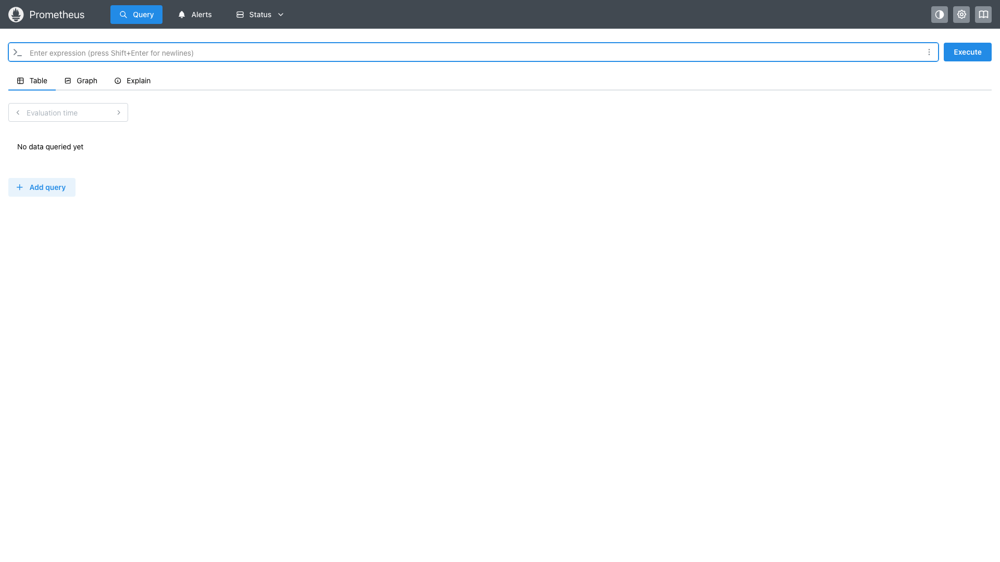
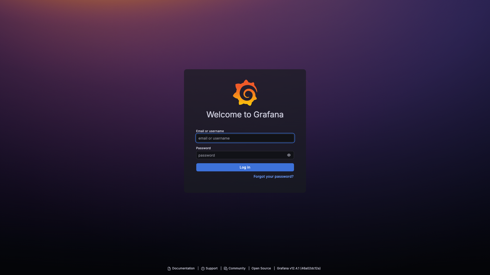
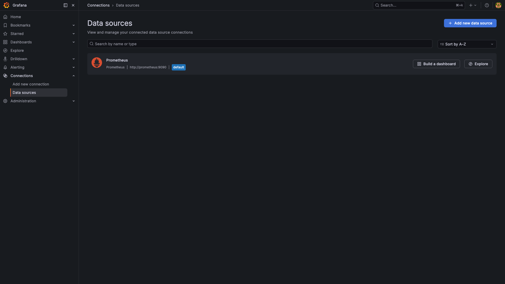
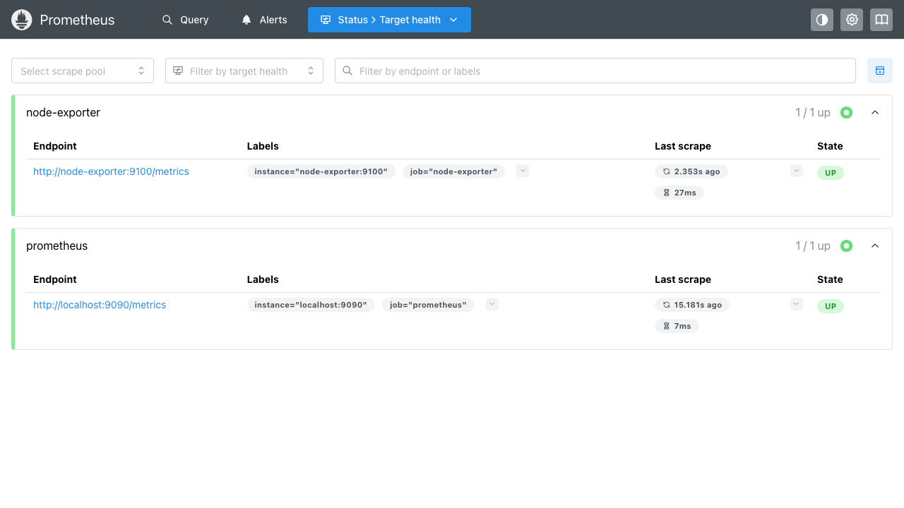
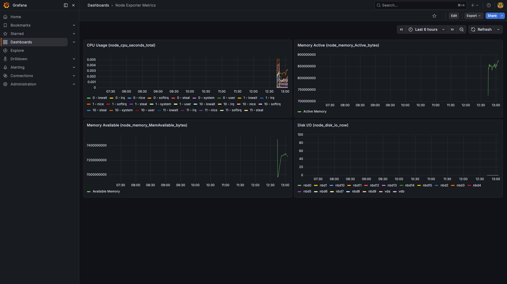

## DevOps Lab — Latanov Daniil

University: [ITMO University](https://itmo.ru/)
Faculty: [FICT](https://fict.itmo.ru/)
Course: [Введение в веб технологии](https://itmo-ict-faculty.github.io/introduction-in-web-tech/)
Year: 2025/2026
Group: U4125
Author: Latanov Daniil
Lab: Lab1, Lab2, Lab3
Date of create: 10.03.2026

---

### Лабораторная работа 1. Основы работы с Docker

#### Описание

Первая лабораторная работа по изучению основ контейнеризации с использованием Docker.

#### Цель работы

Научиться работать с Docker: устанавливать Docker, создавать `Dockerfile`, собирать образы, запускать контейнеры и управлять ими.

#### Ход работы

**1. Docker Desktop уже установлен**

```
$ docker --version
Docker version 28.5.1, build e180ab8
```

**2. Локальные образы**

```
$ docker images
REPOSITORY             TAG         IMAGE ID       CREATED        SIZE
grafana/grafana        latest      e932bd6ed0e0   25 hours ago   950MB
prom/prometheus        latest      4a61322ac110   12 days ago    494MB
prom/node-exporter     latest      3ac34ce007ac   4 months ago   39.5MB
```

**3. Список запущенных контейнеров**

```
$ docker ps
CONTAINER ID   IMAGE                COMMAND       CREATED      STATUS      PORTS
```

**4. Список всех контейнеров**

```
$ docker ps -a
CONTAINER ID   IMAGE                COMMAND       CREATED      STATUS
```

**5. Запустил тестовый контейнер hello-world**

```
$ docker run hello-world

Hello from Docker!
This message shows that your installation appears to be working correctly.

To generate this message, Docker took the following steps:
 1. The Docker client contacted the Docker daemon.
 2. The Docker daemon pulled the "hello-world" image from the Docker Hub.
 3. The Docker daemon created a new container from that image which runs the
    executable that produces the output you are currently reading.
 4. The Docker daemon streamed that output to the Docker client, which sent it
    to your terminal.
```

**6. Скачал образ Ubuntu**

```
$ docker pull ubuntu:latest
latest: Pulling from library/ubuntu
66a4bbbfab88: Pull complete
Digest: sha256:d1e2e92c075e5ca139d51a140fff46f84315c0fdce203eab2807c7e495eff4f9
Status: Downloaded newer image for ubuntu:latest
docker.io/library/ubuntu:latest
```

**7. Запустил интерактивно контейнер и установил пакет curl**

```
$ docker run -it ubuntu bash
root@container:/# apt update && apt install -y curl
...
curl 8.5.0 (aarch64-unknown-linux-gnu) libcurl/8.5.0 OpenSSL/3.0.13 zlib/1.3
Release-Date: 2023-12-06
Protocols: dict file ftp ftps gopher gophers http https imap imaps ldap ldaps mqtt pop3 pop3s rtmp rtsp scp sftp smb smbs smtp smtps telnet tftp
Features: alt-svc AsynchDNS brotli GSS-API HSTS HTTP2 HTTPS-proxy IDN IPv6 Kerberos Largefile libz NTLM PSL SPNEGO SSL threadsafe TLS-SRP UnixSockets zstd
```

**8. Запустил контейнер с nginx (так как образа не было, он скачался)**

```
$ docker run -d -p 8080:80 --name web-server nginx:alpine
Unable to find image 'nginx:alpine' locally
alpine: Pulling from library/nginx
da8475fa07c7: Pull complete
c5ad07fbd6e6: Pull complete
821790ca706f: Pull complete
7833e4e4252c: Pull complete
88799a707571: Pull complete
31d394b0c9ed: Pull complete
9084d2ffc283: Pull complete
Digest: sha256:1d13701a5f9f3fb01aaa88cef2344d65b6b5bf6b7d9fa4cf0dca557a8d7702ba
Status: Downloaded newer image for nginx:alpine
65f3b045e544...
```

**9. Проверил работу на локальном хосте, все корректно**


**10. По логам видно успешное выполнение get запроса**

```
$ docker logs web-server
/docker-entrypoint.sh: /docker-entrypoint.d/ is not empty, will attempt to perform configuration
/docker-entrypoint.sh: Looking for shell scripts in /docker-entrypoint.d/
/docker-entrypoint.sh: Launching /docker-entrypoint.d/10-listen-on-ipv6-by-default.sh
10-listen-on-ipv6-by-default.sh: info: Getting the checksum of /etc/nginx/conf.d/default.conf
10-listen-on-ipv6-by-default.sh: info: Enabled listen on IPv6 in /etc/nginx/conf.d/default.conf
/docker-entrypoint.sh: Sourcing /docker-entrypoint.d/15-local-resolvers.envsh
/docker-entrypoint.sh: Launching /docker-entrypoint.d/20-envsubst-on-templates.sh
/docker-entrypoint.sh: Launching /docker-entrypoint.d/30-tune-worker-processes.sh
/docker-entrypoint.sh: Configuration complete; ready for start up
2026/03/10 10:09:41 [notice] 1#1: nginx/1.29.5
2026/03/10 10:09:41 [notice] 1#1: OS: Linux 6.10.14-linuxkit
2026/03/10 10:09:41 [notice] 1#1: start worker processes
```

**11. Подключился к контейнеру и выполнил команду ls**

```
$ docker exec -it web-server ls /
bin  dev  docker-entrypoint.d  docker-entrypoint.sh  etc  home  lib  media  mnt
opt  proc  root  run  sbin  srv  sys  tmp  usr  var
```

**12. Список запущенных контейнеров (добавился nginx)**

```
$ docker ps
NAMES           IMAGE                STATUS              PORTS
web-server      nginx:alpine         Up About a minute   0.0.0.0:8080->80/tcp
grafana         grafana/grafana      Up 27 minutes       0.0.0.0:3000->3000/tcp
prometheus      prom/prometheus      Up 27 minutes       0.0.0.0:9090->9090/tcp
node-exporter   prom/node-exporter   Up 28 minutes       0.0.0.0:9100->9100/tcp
```

**13. Список всех контейнеров**

```
$ docker ps -a
NAMES                   IMAGE                  STATUS
web-server              nginx:alpine           Up About a minute
zen_mayer               ubuntu                 Exited (0) About a minute ago
blissful_fermi          hello-world            Exited (0) 2 minutes ago
grafana                 grafana/grafana        Up 27 minutes
prometheus              prom/prometheus        Up 27 minutes
node-exporter           prom/node-exporter     Up 28 minutes
```

**14. Остановил, запустил и снова остановил контейнер web-server, удалил контейнер и образ**

```
$ docker stop web-server
web-server

$ docker start web-server
web-server

$ docker stop web-server
web-server

$ docker rm web-server
web-server

$ docker rmi nginx:alpine
Untagged: nginx:alpine
Deleted: sha256:1d13701a5f9f...
```

**15. Создал том, запустил контейнер с томом, подключился к контейнеру, создал файл в томе**

```
$ docker volume create my-volume
my-volume

$ docker run -d -it --name volume-test -v my-volume:/data ubuntu bash
94d5b6dff983...

$ docker exec -it volume-test bash
root@94d5b6dff983:/# echo "Hello from volume" > /data/test.txt
root@94d5b6dff983:/# cat /data/test.txt
Hello from volume
```

**16. Удалил контейнер и создал новый с тем же томом**

```
$ docker rm -f volume-test
volume-test

$ docker run -d -it --name volume-test2 -v my-volume:/data ubuntu bash
3d388a72e334...
```

**17. В контейнере запустил команду ls, далее cat для проверки содержимого файла**

```
$ docker exec volume-test2 ls /data/
test.txt

$ docker exec volume-test2 cat /data/test.txt
Hello from volume
```

Файл сохранился после удаления контейнера — том работает корректно.

---

#### Лабораторная работа со звёздочкой

**1. Создал файлы проекта**

Файл `app.py`:

```python
from flask import Flask

app = Flask(__name__)


@app.route("/")
def hello():
    return "Hello from Docker!"


if __name__ == "__main__":
    app.run(host="0.0.0.0", port=5000)
```

Файл `requirements.txt`:

```
Flask==2.0.1
Werkzeug==2.0.3
```

**2. Создал Dockerfile**

```dockerfile
FROM python:3.9-slim

WORKDIR /app

RUN apt-get update && \
    apt-get install -y --no-install-recommends curl vim && \
    rm -rf /var/lib/apt/lists/*

COPY requirements.txt .
RUN pip install --no-cache-dir -r requirements.txt

COPY app.py .

RUN useradd -u 1000 -m appuser
USER appuser

ENV FLASK_ENV=production

EXPOSE 5000

CMD ["python", "app.py"]
```

**3. Собрал образ**

```
$ docker build -t my-flask-app .
#1 [internal] load build definition from Dockerfile
...
#9 [5/7] RUN pip install --no-cache-dir -r requirements.txt
#9 Collecting Flask==2.0.1
#9   Downloading Flask-2.0.1-py3-none-any.whl (94 kB)
#9 Successfully installed Flask-2.0.1 Jinja2-3.1.6 MarkupSafe-3.0.3 Werkzeug-2.0.3 click-8.1.8 itsdangerous-2.2.0
...
#12 naming to docker.io/library/my-flask-app:latest done
```

**4. Запустил контейнер и проверил работу**

```
$ docker run -d -p 5001:5000 --name flask-container my-flask-app
cc002b21912a...

$ curl http://localhost:5001
Hello from Docker!
```

#### Результаты лабораторной работы

- установленный и настроенный Docker;
- понимание основных команд Docker;
- опыт работы с готовыми образами;
- опыт запуска и управления контейнерами;
- базовый опыт работы с томами;
- создан Dockerfile и Flask-приложение по техническим требованиям;
- приложение работает в контейнере.

---

### Лабораторная работа 2. CI/CD для Docker приложения

#### Описание

Вторая лабораторная работа по настройке CI/CD пайплайна для автоматической сборки, публикации и деплоя Docker образа из первой лабораторной работы.

#### Цель работы

Научиться настраивать автоматизированные пайплайны для сборки Docker образов, их публикации в registry и автоматического деплоя при изменении кода.

#### Ход работы

**1. Создал аккаунт на Docker Hub и репозиторий**

Создан репозиторий на Docker Hub для хранения Docker-образов.

**2. Создал папку `.github/workflows/` и файл `docker-build.yml` с пайплайном**

```yaml
name: Docker Build and Push

on:
  push:
    branches: [ main ]

jobs:
  build-and-push:
    runs-on: ubuntu-latest

    steps:
      - name: Checkout code
        uses: actions/checkout@v4

      - name: Set up Docker Buildx
        uses: docker/setup-buildx-action@v3

      - name: Login to Docker Hub
        uses: docker/login-action@v3
        with:
          username: ${{ secrets.DOCKER_USERNAME }}
          password: ${{ secrets.DOCKER_PASSWORD }}

      - name: Build and push Docker image
        uses: docker/build-push-action@v5
        with:
          context: .
          push: true
          tags: ${{ secrets.DOCKER_USERNAME }}/my-flask-app:latest

      - name: Deploy
        run: echo "Deploying to production server..."
```

**3. В настройках репозитория добавил секреты, которые используются в `docker-build.yml`**

В разделе Settings → Secrets and variables → Actions добавлены:
- `DOCKER_USERNAME` — логин Docker Hub
- `DOCKER_PASSWORD` — пароль/токен Docker Hub

**4. Сделал коммит и пуш в ветку main**

```
$ git add .
$ git commit -m "Add Dockerfile, Flask app, CI/CD workflow, Prometheus monitoring"
$ git push origin main
```

**5. Выполнение пайплайна в Actions**

После пуша в main автоматически запустился пайплайн GitHub Actions, который:
- Выполнил checkout кода
- Настроил Docker Buildx
- Залогинился в Docker Hub
- Собрал и запушил образ с тегом `username/my-flask-app:latest`
- Вывел сообщение о деплое

**6. Образ на Docker Hub**

Образ `my-flask-app:latest` успешно опубликован в Docker Hub.

#### Результаты лабораторной работы

- настроен CI/CD пайплайн с GitHub Actions;
- настроены секреты для безопасной работы с Docker Hub;
- автоматическая сборка и публикация Docker образа при пуше в main;
- пайплайн включает шаги: checkout, buildx, login, build+push, deploy.

---

### Лабораторная работа 3. Мониторинг с Prometheus и Grafana

#### Описание

Третья лабораторная работа по настройке системы мониторинга с использованием Prometheus для сбора метрик и Grafana для визуализации данных.

#### Цель работы

Научиться настраивать локальную систему мониторинга, собирать метрики с помощью Prometheus и создавать дашборды в Grafana для визуализации данных.

#### Ход работы

**1. Создал файл `prometheus/prometheus.yml` с информацией о частоте сбора метрик, метриками Prometheus и метриками системы**

```yaml
global:
  scrape_interval: 15s

scrape_configs:
  - job_name: 'prometheus'
    static_configs:
      - targets: ['localhost:9090']

  - job_name: 'node-exporter'
    static_configs:
      - targets: ['node-exporter:9100']
```

**2. Запустил контейнер Node Exporter и проверил его работу**

```
$ docker run -d \
  --name node-exporter \
  --restart=unless-stopped \
  -p 9100:9100 \
  prom/node-exporter
a46e43e22c02...

$ curl http://localhost:9100/metrics
# HELP go_gc_duration_seconds A summary of the wall-time pause duration...
# TYPE go_gc_duration_seconds summary
go_gc_duration_seconds{quantile="0"} 0
go_gc_duration_seconds{quantile="0.25"} 0
...
```

**3. Создал том `prometheus-data`, для работы с Grafana создал общую сеть `monitoring`**

```
$ docker volume create prometheus-data
prometheus-data

$ docker network create monitoring
cc06abe2eed6...

$ docker network connect monitoring node-exporter
```

**4. Запустил контейнер Prometheus**

```
$ docker run -d \
  --name prometheus \
  --network monitoring \
  --restart=unless-stopped \
  -p 9090:9090 \
  -v prometheus-data:/prometheus \
  -v $(pwd)/prometheus:/etc/prometheus \
  prom/prometheus \
  --config.file=/etc/prometheus/prometheus.yml \
  --storage.tsdb.path=/prometheus \
  --web.console.libraries=/etc/prometheus/console_libraries \
  --web.console.templates=/etc/prometheus/consoles \
  --storage.tsdb.retention.time=200h \
  --web.enable-lifecycle
26240d08be5f...
```

**5. Работа Prometheus на локальном хосте**

Открыл `http://localhost:9090` в браузере:



**6. Создал том `grafana-data` и запустил контейнер Grafana**

```
$ docker volume create grafana-data
grafana-data

$ docker run -d \
  --name grafana \
  --network monitoring \
  --restart=unless-stopped \
  -p 3000:3000 \
  -v grafana-data:/var/lib/grafana \
  -e "GF_SECURITY_ADMIN_PASSWORD=admin" \
  grafana/grafana
ee9578eb745b...
```

**7. На локальном хосте Grafana работает**

Открыл `http://localhost:3000` в браузере:



**8. Залогинился под админом в Grafana, далее добавил источник данных Prometheus**

- Configuration → Data Sources → Add data source
- Выбрал Prometheus
- URL: `http://prometheus:9090`
- Save & Test



**9. В Prometheus проверил доступность node-exporter**

Оба таргета (node-exporter и prometheus) в статусе UP:



**10. Добавил метрики `node_cpu_seconds_total`, `node_memory_Active_bytes`, `node_memory_MemAvailable_bytes`, `node_disk_io_now`**

Создал дашборд "Node Exporter Metrics" с четырьмя графиками:
- CPU Usage (`node_cpu_seconds_total`)
- Memory Active (`node_memory_Active_bytes`)
- Memory Available (`node_memory_MemAvailable_bytes`)
- Disk I/O (`node_disk_io_now`)



**11. Проверка контейнеров**

```
$ docker ps
NAMES           IMAGE                STATUS          PORTS
grafana         grafana/grafana      Up              0.0.0.0:3000->3000/tcp
prometheus      prom/prometheus      Up              0.0.0.0:9090->9090/tcp
node-exporter   prom/node-exporter   Up              0.0.0.0:9100->9100/tcp
```

**12. Метрики собираются, данные визуализируются**

Система мониторинга полностью настроена и функционирует:
- Node Exporter собирает системные метрики (CPU, память, диск)
- Prometheus агрегирует метрики от Node Exporter и собственные метрики
- Grafana визуализирует данные на дашборде с четырьмя графиками

#### Результаты лабораторной работы

- настроена конфигурация Prometheus (`prometheus.yml`);
- запущен контейнер Node Exporter для сбора системных метрик;
- запущен контейнер Prometheus для агрегации метрик;
- запущен контейнер Grafana для визуализации данных;
- создана общая Docker-сеть `monitoring` для связи контейнеров;
- добавлен источник данных Prometheus в Grafana;
- создан дашборд с метриками CPU, памяти и диска;
- система мониторинга работает корректно, метрики собираются и визуализируются.
