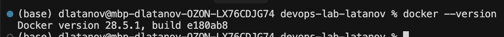
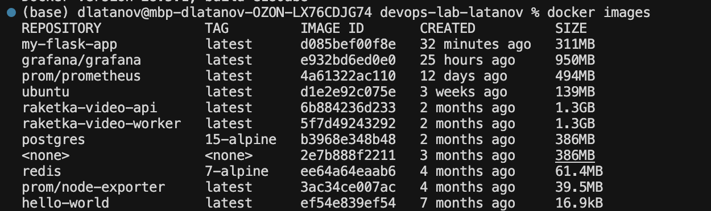
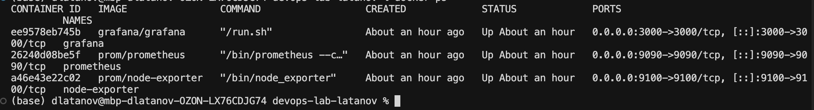
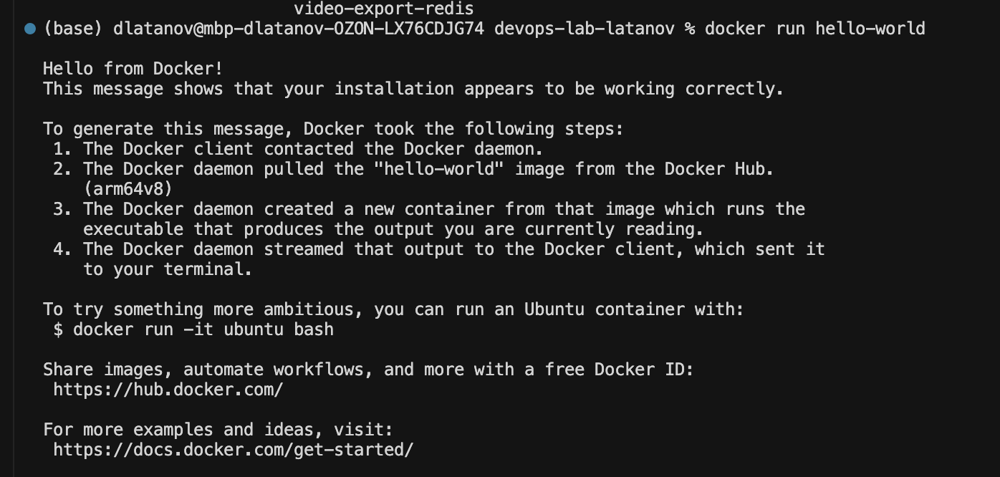
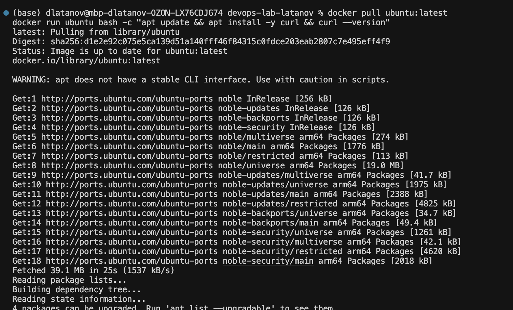
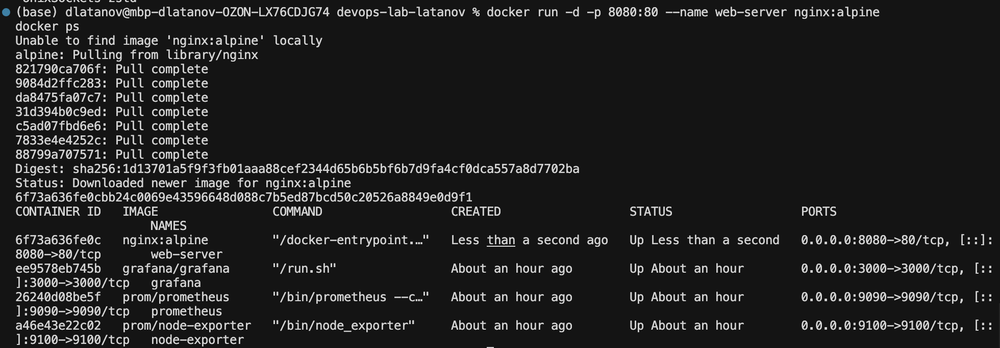
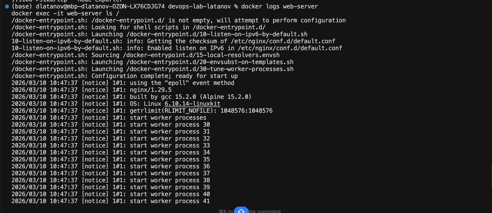
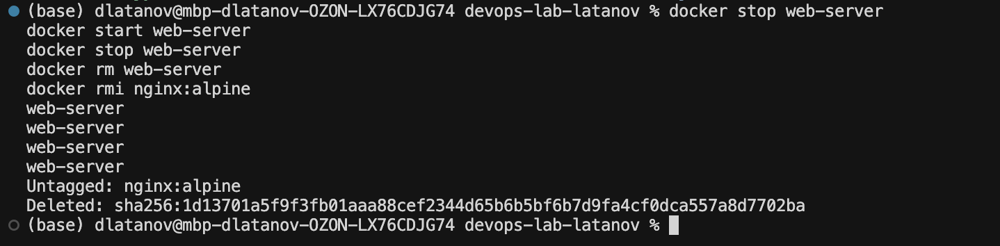
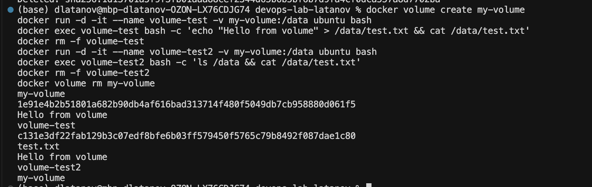
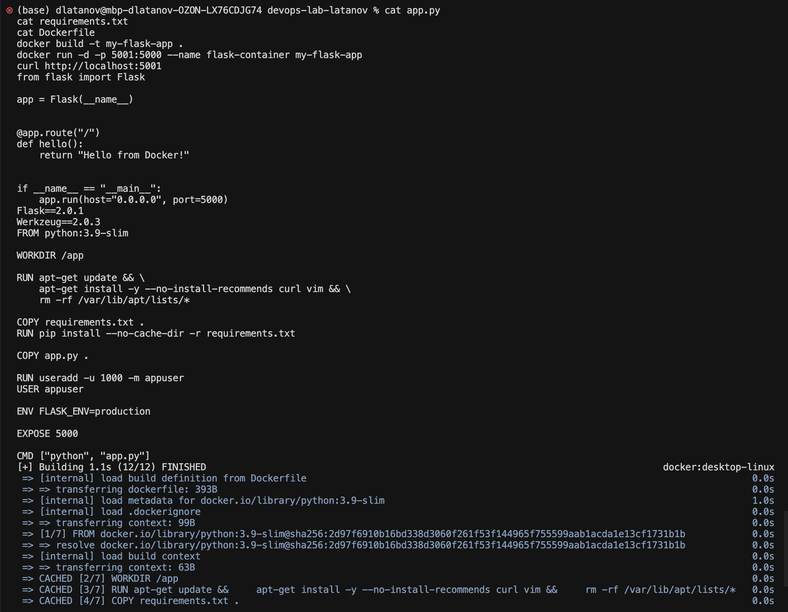

## DevOps Lab — Latanov Daniil

University: [ITMO University](https://itmo.ru/)
Course: [Введение в веб технологии](https://itmo-ict-faculty.github.io/introduction-in-web-tech/)
Year: 2025/2026
Group: U4125
Author: Latanov Daniil
Lab: Lab1, Lab2, Lab3
Date of create: 10.03.2026

---

### Лабораторная работа 1. Основы работы с Docker

#### Описание

Первая лабораторная по Docker: разбираюсь с базовыми командами, контейнерами, образами и томами.

#### Цель работы

Научиться работать с Docker: устанавливать Docker, создавать `Dockerfile`, собирать образы, запускать контейнеры и управлять ими.

#### Ход работы

1. **Проверил, что Docker живой**

   В терминале в корне проекта запустил базовые команды, чтобы убедиться, что Docker установлен и демон запущен:

   - `docker --version`
   - `docker images`
   - `docker ps`
   - `docker ps -a`

   Скрин с моим терминалом:  
     
     
   

2. **Запустил самый простой контейнер `hello-world`**

   Просто проверка, что контейнеры вообще стартуют:

   ```bash
   docker run hello-world
   ```

   На скрине видно стандартный текст `Hello from Docker!` и мой терминал:  
   

3. **Скачал Ubuntu и внутри контейнера поставил `curl`**

   - сначала подтянул образ:

     ```bash
     docker pull ubuntu:latest
     ```

   - потом запустил контейнер и внутри поставил `curl`, чтобы убедиться, что всё работает:

     ```bash
     docker run ubuntu bash -c "apt update && apt install -y curl && curl --version"
     ```

   Скрин:  
   

4. **Поднял nginx и проверил, что он отдает стартовую страницу**

   - запускаю nginx в контейнере:

     ```bash
     docker run -d -p 8080:80 --name web-server nginx:alpine
     docker ps
     ```

   - в браузере открываю `http://localhost:8080` и вижу стандартный экран “Welcome to nginx!”.

   Скрины:

   - терминал с запуском контейнера:  
     
   - браузер с главной страницей nginx:  
     

5. **Посмотрел логи nginx и залез внутрь контейнера**

   Здесь просто проверил, что nginx нормально стартует и что я могу зайти внутрь контейнера:

   ```bash
   docker logs web-server
   docker exec -it web-server ls /
   ```

   Скрин с логами и `ls /` внутри контейнера:  
   

6. **Потренировался управлять контейнером: stop/start/rm и удаление образа**

   Последовательно остановил контейнер, снова запустил, ещё раз остановил, потом удалил и почистил образ:

   ```bash
   docker stop web-server
   docker start web-server
   docker stop web-server
   docker rm web-server
   docker rmi nginx:alpine
   ```

   Всё это зафиксировано на отдельном скрине:  
   

7. **Проверил работу Docker volume**

   Хотел убедиться, что данные действительно живут там, а не в контейнере:

   ```bash
   docker volume create my-volume
   docker run -d -it --name volume-test -v my-volume:/data ubuntu bash
   docker exec volume-test bash -c 'echo "Hello from volume" > /data/test.txt && cat /data/test.txt'
   docker rm -f volume-test

   docker run -d -it --name volume-test2 -v my-volume:/data ubuntu bash
   docker exec volume-test2 bash -c 'ls /data && cat /data/test.txt'
   docker rm -f volume-test2
   docker volume rm my-volume
   ```

   На скрине видно, что файл `test.txt` никуда не пропал после пересоздания контейнера:  
   

---

#### Лабораторная работа со звёздочкой

**1. Собрал маленькое Flask‑приложение**

Файл `app.py`:

```python
from flask import Flask

app = Flask(__name__)


@app.route("/")
def hello():
    return "Hello from Docker!"


if __name__ == "__main__":
    app.run(host="0.0.0.0", port=5000)
```

Файл `requirements.txt`:

```
Flask==2.0.1
```

**2. Описал контейнер в Dockerfile**

```dockerfile
FROM python:3.9-slim

WORKDIR /app

RUN apt-get update && \
    apt-get install -y --no-install-recommends curl vim && \
    rm -rf /var/lib/apt/lists/*

COPY requirements.txt .
RUN pip install --no-cache-dir -r requirements.txt

COPY app.py .

RUN useradd -u 1000 -m appuser
USER appuser

ENV FLASK_ENV=production

EXPOSE 5000

CMD ["python", "app.py"]
```

**3. Собрал образ и проверил, что он реально работает**

Выполнил команды:

```bash
docker build -t my-flask-app .
docker run -d -p 5001:5000 --name flask-container my-flask-app
curl http://localhost:5001
```

На скрине видно и процесс сборки, и запуск контейнера, и ответ `Hello from Docker!` прямо в моём терминале:  


#### Результаты лабораторной работы

- установленный и настроенный Docker;
- понимание основных команд Docker;
- опыт работы с готовыми образами;
- опыт запуска и управления контейнерами;
- базовый опыт работы с томами;
- создан Dockerfile и Flask-приложение по техническим требованиям;
- приложение работает в контейнере.

---

### Лабораторная работа 2. CI/CD для Docker приложения

#### Описание

Во второй лабе я подключаю автоматизацию: на каждый пуш в `main` мой Docker‑образ с Flask‑приложением собирается и улетает в Docker Hub.

#### Цель работы

Научиться настраивать автоматизированные пайплайны для сборки Docker образов, их публикации в registry и автоматического деплоя при изменении кода.

#### Ход работы

1. **Завёл репозиторий на Docker Hub под своё приложение**

   В Docker Hub создал отдельный репозиторий под образ Flask‑приложения. Логин использую тот же, что и в GitHub (для удобства).

2. **Настроил GitHub Actions: создал `.github/workflows/docker-build.yml`**

   В репозитории добавил папку `.github/workflows/` и внутри файл `docker-build.yml`.  
   В нём один джоб, который крутится на `ubuntu-latest` и делает всё по шагам:

   ```yaml
   name: Docker Build and Push

   on:
     push:
       branches: [ main ]

   jobs:
     build-and-push:
       runs-on: ubuntu-latest

       steps:
         - name: Checkout code
           uses: actions/checkout@v4

         - name: Set up Docker Buildx
           uses: docker/setup-buildx-action@v3

         - name: Login to Docker Hub
           uses: docker/login-action@v3
           with:
             username: ${{ secrets.DOCKER_USERNAME }}
             password: ${{ secrets.DOCKER_PASSWORD }}

         - name: Build and push Docker image
           uses: docker/build-push-action@v5
           with:
             context: .
             push: true
             tags: ${{ secrets.DOCKER_USERNAME }}/my-flask-app:latest

         - name: Deploy
           run: echo "Deploying to production server..."
   ```

3. **Подключил секреты для логина в Docker Hub**

   В настройках репозитория GitHub (Settings → Secrets and variables → Actions) завёл два секрета:

   - `DOCKER_USERNAME` — мой логин на Docker Hub;
   - `DOCKER_PASSWORD` — пароль или access‑token.

   После этого workflow может логиниться в Docker Hub без того, чтобы пароль светился в коде.

4. **Сделал обычный коммит и пуш в `main`, чтобы триггернуть пайплайн**

   ```bash
   git add .
   git commit -m "Add Dockerfile, Flask app, CI/CD workflow, Prometheus monitoring"
   git push origin main
   ```

5. **Посмотрел, как отработал пайплайн в GitHub Actions**

   Вкладка Actions в репозитории → выбрал последний workflow run.  
   По шагам видно, что:

   - код успешно checkout‑нулся;
   - Buildx поднялся без ошибок;
   - логин в Docker Hub прошёл;
   - образ собрался и был отправлен в репозиторий `…/my-flask-app:latest`;
   - шаг Deploy вывел своё сообщение.

   (При желании сюда можно добавить скриншот с UI Actions, но пока оставил текстовое описание.)

6. **Проверил, что образ реально появился в Docker Hub**

   В Docker Hub в репозитории вижу новый тег `latest` для `my-flask-app`.  
   При необходимости можно стянуть его командой `docker pull username/my-flask-app:latest` и запустить на любой машине.

#### Результаты лабораторной работы

- настроен CI/CD пайплайн с GitHub Actions;
- настроены секреты для безопасной работы с Docker Hub;
- автоматическая сборка и публикация Docker образа при пуше в main;
- пайплайн включает шаги: checkout, buildx, login, build+push, deploy.

---

### Лабораторная работа 3. Мониторинг с Prometheus и Grafana

#### Описание

В третьей лабе собираю локальный стенд мониторинга: Prometheus тянет метрики с node‑exporter, а Grafana рисует красивые графики по этим данным.

#### Цель работы

Научиться настраивать локальную систему мониторинга, собирать метрики с помощью Prometheus и создавать дашборды в Grafana для визуализации данных.

#### Ход работы

1. **Описал, что именно будет мониторить Prometheus**

   В корне проекта создал папку `prometheus` и внутри файл `prometheus.yml`.  
   В нём задал интервал сбора и два job’а: сам Prometheus и node‑exporter:

   ```yaml
   global:
     scrape_interval: 15s

   scrape_configs:
     - job_name: 'prometheus'
       static_configs:
         - targets: ['localhost:9090']

     - job_name: 'node-exporter'
       static_configs:
         - targets: ['node-exporter:9100']
   ```

2. **Поднял node‑exporter и посмотрел “сырые” метрики**

   Запустил контейнер с node‑exporter и убедился, что по HTTP реально отдаются метрики:

   ```bash
   docker run -d \
     --name node-exporter \
     --restart=unless-stopped \
     -p 9100:9100 \
     prom/node-exporter

   curl http://localhost:9100/metrics | head
   ```

   В ответе видно стандартные метрики Go и системы (`go_gc_duration_seconds`, `go_goroutines` и т.д.).

3. **Подготовил данные и сеть для Prometheus и Grafana**

   - отдельный volume для данных Prometheus;
   - отдельная Docker‑сеть, куда я потом подключаю все сервисы:

   ```bash
   docker volume create prometheus-data
   docker network create monitoring
   docker network connect monitoring node-exporter
   ```

4. **Запустил Prometheus и проверил, что он жив**

   ```bash
   docker run -d \
     --name prometheus \
     --network monitoring \
     --restart=unless-stopped \
     -p 9090:9090 \
     -v prometheus-data:/prometheus \
     -v $(pwd)/prometheus:/etc/prometheus \
     prom/prometheus \
     --config.file=/etc/prometheus/prometheus.yml \
     --storage.tsdb.path=/prometheus \
     --web.console.libraries=/etc/prometheus/console_libraries \
     --web.console.templates=/etc/prometheus/consoles \
     --storage.tsdb.retention.time=200h \
     --web.enable-lifecycle
   ```

   После старта открыл `http://localhost:9090` и увидел стандартный интерфейс Prometheus:  
   

5. **Поднял Grafana для визуализации**

   Создал отдельный volume под данные Grafana и запустил контейнер в той же сети `monitoring`:

   ```bash
   docker volume create grafana-data

   docker run -d \
     --name grafana \
     --network monitoring \
     --restart=unless-stopped \
     -p 3000:3000 \
     -v grafana-data:/var/lib/grafana \
     -e "GF_SECURITY_ADMIN_PASSWORD=admin" \
     grafana/grafana
   ```

   В браузере открыл `http://localhost:3000` и залогинился под `admin/admin`:  
   

6. **Сконнектил Grafana с Prometheus**

   В Grafana зашёл в **Connections → Data sources**, добавил новый источник данных Prometheus и указал URL `http://prometheus:9090` (контейнеры в одной сети, поэтому именно hostname `prometheus`).

   После `Save & Test` источник стал зелёным:  
   

7. **Проверил в Prometheus, что таргеты реально `UP`**

   На странице `Status → Targets` видно два таргета:

   - `node-exporter:9100`;
   - `localhost:9090` (сам Prometheus).

   Оба в состоянии `UP`:  
   

8. **Собрал свой дашборд в Grafana**

   Создал дашборд `Node Exporter Metrics` и добавил туда 4 графика:

   - CPU Usage — `rate(node_cpu_seconds_total{mode!="idle"}[5m])`;
   - Memory Active — `node_memory_Active_bytes`;
   - Memory Available — `node_memory_MemAvailable_bytes`;
   - Disk I/O — `node_disk_io_now`.

   На скрине видно, что графики рисуются и метрики приходят:  
   

9. **Убедился, что все контейнеры живы**

   В терминале:

   ```bash
   docker ps
   ```

   В списке вижу три контейнера:

   - `grafana` на порту `3000`;
   - `prometheus` на `9090`;
   - `node-exporter` на `9100`.

#### Результаты лабораторной работы

- настроена конфигурация Prometheus (`prometheus.yml`);
- запущен контейнер Node Exporter для сбора системных метрик;
- запущен контейнер Prometheus для агрегации метрик;
- запущен контейнер Grafana для визуализации данных;
- создана общая Docker-сеть `monitoring` для связи контейнеров;
- добавлен источник данных Prometheus в Grafana;
- создан дашборд с метриками CPU, памяти и диска;
- система мониторинга работает корректно, метрики собираются и визуализируются.
